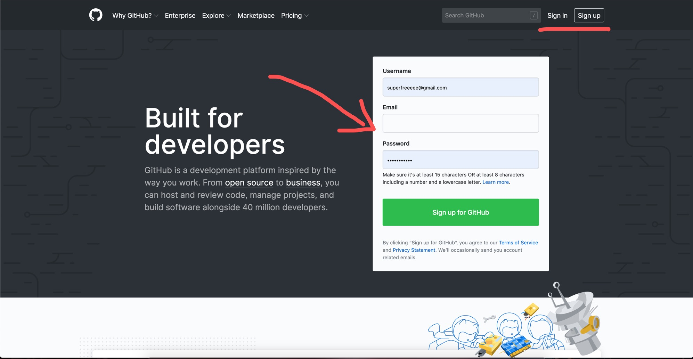
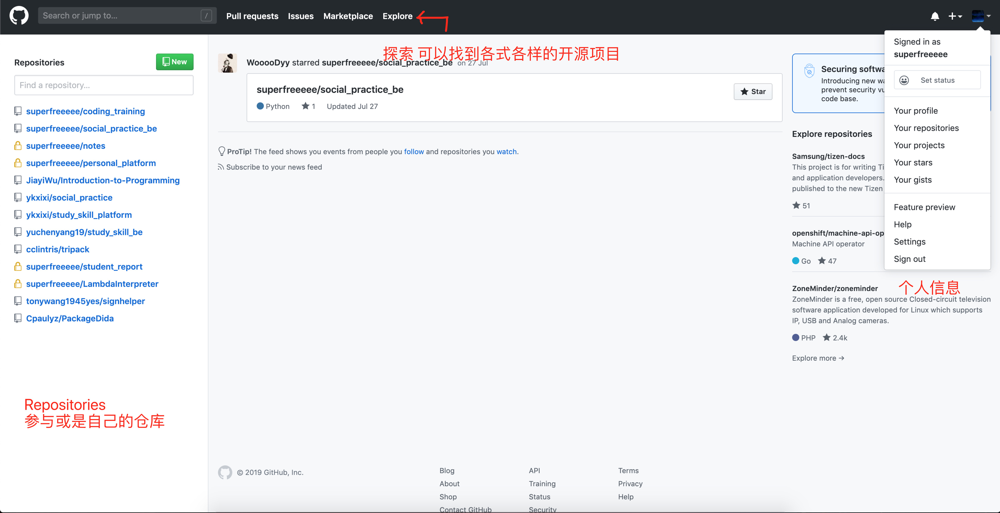
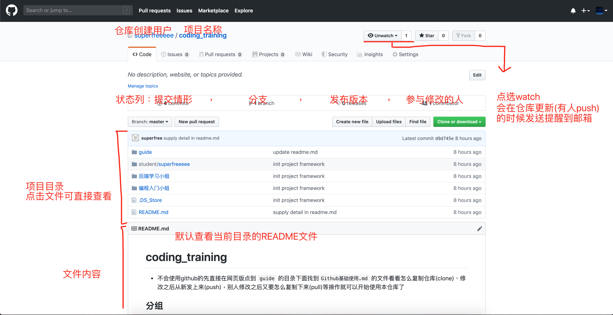
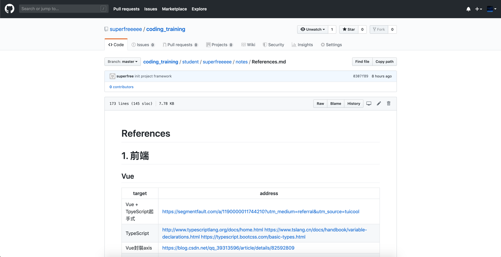
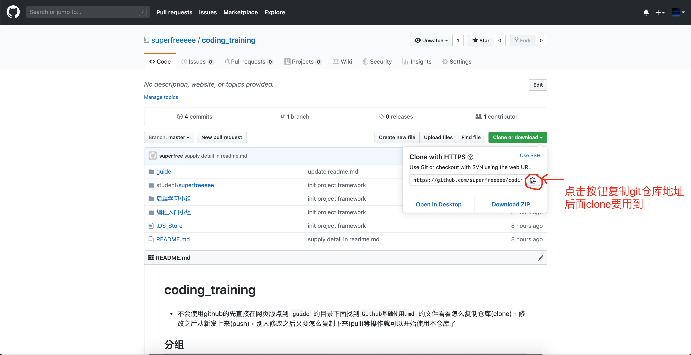
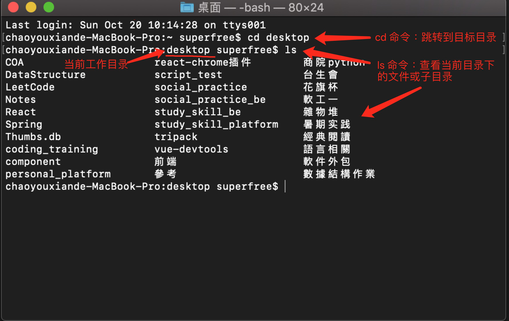

# Github 使用
- Github首页地址：https://github.com/
- 此为最基础的教程，更多github的功能等待你去挖掘（其实是我也不会

## 注册与登入
- 首页可注册，右上角有登入与注册选项


## 登入后
- 主页


- 选择某一个仓库(Repository)之后



- 获取远程git仓库地址(后面clone要用到)


## 本地(就是你的电脑啦)git安装
- https://git-scm.com/book/zh/v2/%E8%B5%B7%E6%AD%A5-%E5%AE%89%E8%A3%85-Git  
找到自己的操作系统对应的步骤走

## 使用git克隆仓库下来
- 进入自己电脑的终端机/命令行工具(windows在搜寻cmd，mac在spotlight查terminal)，进入黑框框


- 克隆：`git clone [远程仓库地址]`
```sh
# 第一次下载项目的时候要进行clone动作
# 在命令行输入以下指令克隆远程仓库到当前目录，$表示命令行开头不用输入
$ git clone https://github.com/superfreeeee/coding_training.git
```
克隆下来之后就能在本地看到文件夹了

- 提交：`add`, `commit`, `push`
```sh
# 先进入仓库目录下
$ cd coding_training
# 添加修改：
# git add [添加内容，'.'表示全部]
$ git add .
# 提交：
# git commit -m '[提交信息/说明]'
$ git commit -m 'test'
# 合并到远程仓库
$ git push

# 如果之后在你push之前已经有人提交到远程仓库
# 需要先拉取新内容与自己的本地仓库合并
$ git pull
```

## 结语
这个教程就到此结束啦，到目前就应该能正常在github上使用git工具工作啦
如果想操作过程有问题立马在群里面问出来，最好截个图把错误信息发上来
其他更多的git相关理论知识(版本更新、本地仓库、远程仓库、仓库的删除、合并、返回旧版本、比较版本差异)等见其他教学或是自己探索或是问学长姐有没有相关资源啰～
